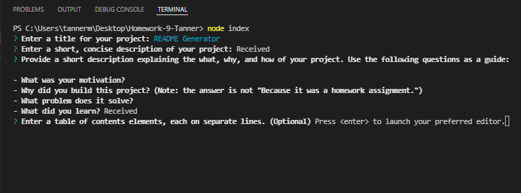
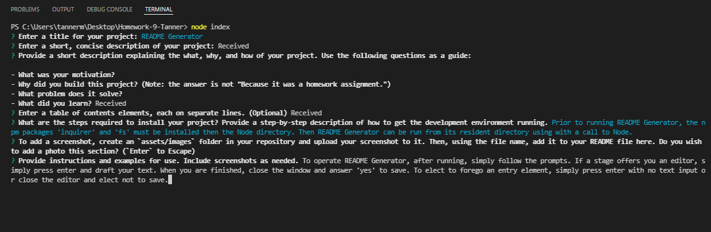

# README Generator

(This is the actual project README document)

## [Video Link](https://youtu.be/hr5PzA3yqps)
## [Code](./index.js)
## [Sample README.md](./sample_README.md)

## Description
The application enables the user to quickly produce README documents that conform closely to industry standards.

## Motivation 
The application is intended to guide the user, using npm model inquirer prompts, to draft a README document conforming to industry standards while automating many formating tasks so that the user may more closely focus on the content.

## Installation
Prior to running 'README Generator', the npm packages 'inquirer' and 'fs' must be installed in the Node directory. Then 'README Generator' can be run from it's resident directory with a call to Node.

## Usage
Simply follow the prompts and focus on content. Input type prompts expect text from the command line. Enter with no text input to cancel. Editor prompt open your default editor for input. Elect to save upon exiting. Exit without entering text or saving to cancel. After the final prompt is resolved, the README.md file will be created in the local director. 

## License
MIT License

Copyright (c) 2022 Matthew J. Tanner

Permission is hereby granted, free of charge, to any person obtaining a copy
of this software and associated documentation files (the "Software"), to deal
in the Software without restriction, including without limitation the rights
to use, copy, modify, merge, publish, distribute, sublicense, and/or sell
copies of the Software, and to permit persons to whom the Software is
furnished to do so, subject to the following conditions:

The above copyright notice and this permission notice shall be included in all
copies or substantial portions of the Software.

THE SOFTWARE IS PROVIDED "AS IS", WITHOUT WARRANTY OF ANY KIND, EXPRESS OR
IMPLIED, INCLUDING BUT NOT LIMITED TO THE WARRANTIES OF MERCHANTABILITY,
FITNESS FOR A PARTICULAR PURPOSE AND NONINFRINGEMENT. IN NO EVENT SHALL THE
AUTHORS OR COPYRIGHT HOLDERS BE LIABLE FOR ANY CLAIM, DAMAGES OR OTHER
LIABILITY, WHETHER IN AN ACTION OF CONTRACT, TORT OR OTHERWISE, ARISING FROM,
OUT OF OR IN CONNECTION WITH THE SOFTWARE OR THE USE OR OTHER DEALINGS IN THE
SOFTWARE.
